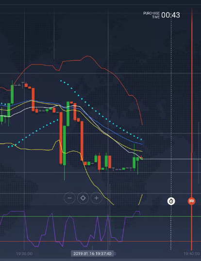

## BINARY OPTIONS USING BRAIN.JS

Predict binary options using brain.js<br>
https://github.com/BrainJS/brain.js

This is a test using this course:<br>
https://scrimba.com/playlist/pVZJQfg

For now it is underdevelopment.

### INFO ABOUT

The raw data(raw.json) was extracted from iqoption<br>
it was handled to create a period like this:

Each expiration is a purchase time.



this image represents one expiration object bellow

```
{
    "EURUSD": [
        {
            "expiration": 1546736640,
            "candles": [
                {
                    "active_id": 76,
                    "size": 5,
                    "at": 1546736642035200800,
                    "from": 1546736640,
                    "to": 1546736645,
                    "id": 7471732,
                    "open": 1.135453,
                    "close": 1.135449,
                    "min": 1.135449,
                    "max": 1.135453,
                    "ask": 1.135449,
                    "bid": 1.135449,
                    "volume": 0,
                    "phase": "T"
                },
                {
                    "active_id": 76,
                    "size": 5,
                    "at": 1546736642634810600,
                    "from": 1546736640,
                    "to": 1546736645,
                    "id": 7471732,
                    "open": 1.135453,
                    "close": 1.135452,
                    "min": 1.135449,
                    "max": 1.135453,
                    "ask": 1.135452,
                    "bid": 1.135452,
                    "volume": 0,
                    "phase": "T"
                }
            ]
        },
		{
            "expiration": 1546736640,
            "candles": [
                {
                    "active_id": 76,
                    "size": 5,
                    "at": 1546736642035200800,
                    "from": 1546736640,
                    "to": 1546736645,
                    "id": 7471732,
                    "open": 1.135453,
                    "close": 1.135449,
                    "min": 1.135449,
                    "max": 1.135453,
                    "ask": 1.135449,
                    "bid": 1.135449,
                    "volume": 0,
                    "phase": "T"
                },
                {
                    "active_id": 76,
                    "size": 5,
                    "at": 1546736642634810600,
                    "from": 1546736640,
                    "to": 1546736645,
                    "id": 7471732,
                    "open": 1.135453,
                    "close": 1.135452,
                    "min": 1.135449,
                    "max": 1.135453,
                    "ask": 1.135452,
                    "bid": 1.135452,
                    "volume": 0,
                    "phase": "T"
                }
            ]
        },
```


I simplified this data to first tests.

then my training data is like this:<br>
where the inputs are all "close" from a purchase time<br>
the output is what action is better for this period.

In a future version I will analyse all candles and see if
this purchase time is profitable and when I should buy in this purshase time.

```
[
  {
    "input": [
      1.000043156596794,
      1.000043156596794,
      1.000045798837414,
      1.000045798837414,
      1.0000493218249076
    ],
    "output": [
      "buy"
    ]
  },
  {
    "input": [
      1.0000493218249076,
      1.0000493218249076,
      1.0000493218249076,
      1.000047560331161,
      1.000047560331161
    ],
    "output": [
      "sell"
    ]
  },
  {
    "input": [
      1.0000502025717808,
      1.0000502025717808,
      1.000022899418707,
      1.000022899418707,
      1.0000237801655805
    ],
    "output": [
      "sell"
    ]
  },
  {
    "input": [
      1.0000237801655805,
      1.0000299453936938,
      1.0000299453936938,
      1.0000264224062005,
      1.0000264224062005
    ],
    "output": [
      "buy"
    ]
  }
]
```

## what i'm doing

I'm using `brain.recurrent.LSTMTimeStep`


## what is happen

error on console:
Uncaught Error: network error rate is unexpected NaN, check network configurations and try again


## Tools

to calculate indicators
https://www.npmjs.com/package/technicalindicators

https://github.com/misha-marinenko-official/BrainIDE